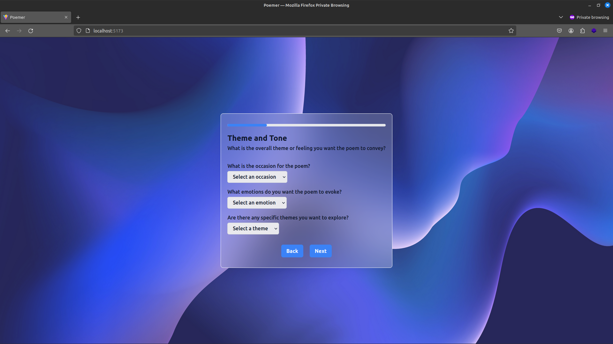
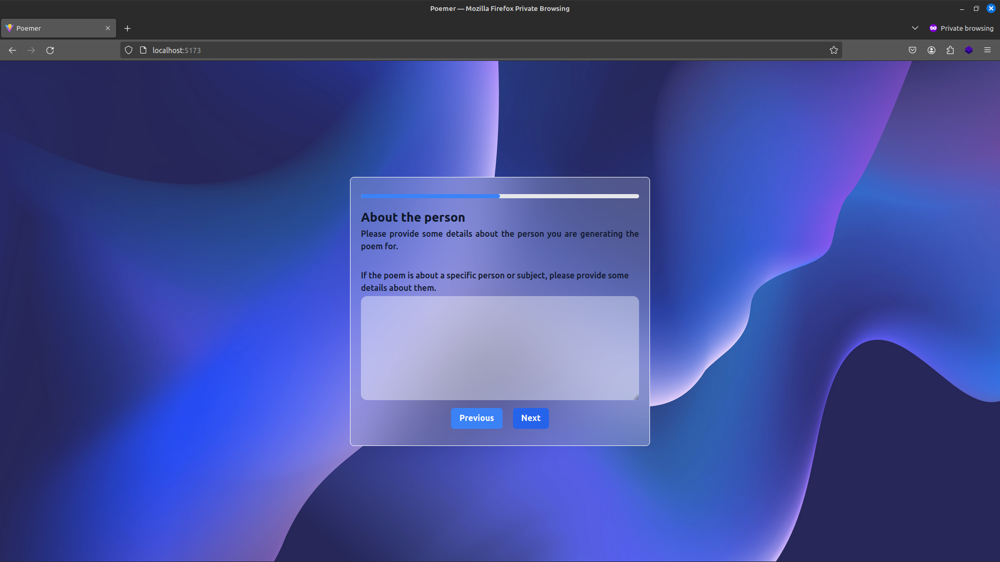
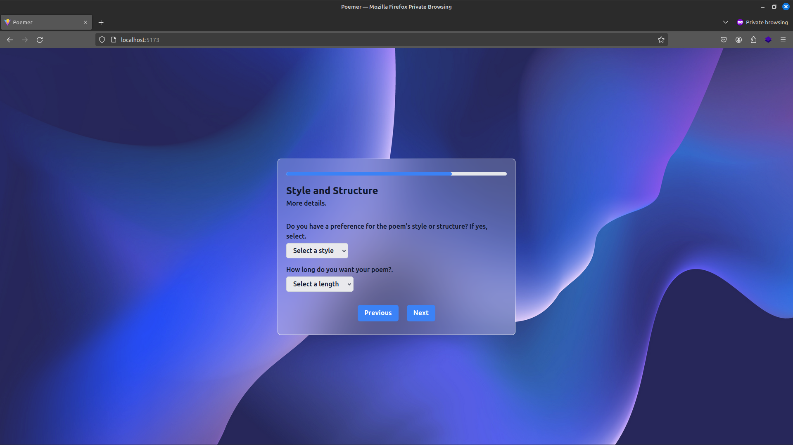

**Poemer**

Badge: [https://opensource.org/licenses/MIT](https://opensource.org/licenses/MIT)

**Description:**

I was intrigued to build this app specifically for my girlfriend because I'm not so good with writing poems and all. I've read poems written by my friends, directed to the ones they cherish and then I was motivated to create something using Google's Gemini.

**Features:**

- Create poems crafted specifically for you

**Technologies:**

- [React](https://react.dev/)
- [Vite](https://vitejs.dev/)
- [Google gemini](https://ai.google.dev/docs)

**Installation:**

- Clone repo to your local machine.
- Install project dependencies.

```bash
  pnpm install
```

- Create and copy your API key for [google gemini](https://makersuite.google.com/app/apikey)
- Create a .env file in the project root and paste the following

```bash
  VITE_GEN_API_KEY=[YOUR_API_KEY]
```

- Run the project

```bash
  pnpm run dev
```

**Usage:**

- Generating a poem involves completing the stepper form.
- The Stepper form accepts deta based on your preference so as to allow the gemini model to generate personalised poem for every scenario.
  
  
  

**Contributing:**

If you'll like to drop a contribution, please specify [here](https://github.com/OlamideSimon/poemer/issues) or make a [pull request](https://github.com/OlamideSimon/poemer/pulls)

**Author:**

- [Olamide Simon](https://github.com/OlamideSimon)
